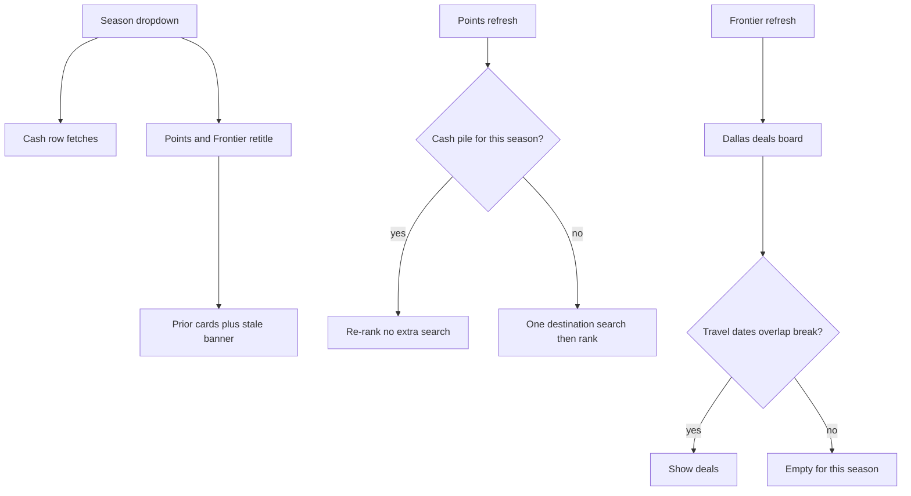

# Requirements: points value and Frontier Dallas rows

## Summary

Add two rows under cheapest-anywhere on `/personal`: a points-value row (Chase Sapphire Reserve and Amex Blue Business Plus) and a Frontier-from-Dallas row. Cash, points, and Frontier share one season. Cash keeps its existing refresh. Each new row refreshes only on its own command. The cash row drops the 6-hour cap and may include international.

---

## Problem Frame

The personal flights page already ranks cheap cash fares for school breaks, but it cannot say whether those trips are a good use of Chase or Amex points. The usual check is open Chase/Amex, convert the cash fare, and see if the portal is surcharging versus cash — then consider transferring to a partner. That comparison is not on the page.

Separately, Frontier emails a Dallas deals board with cheap tickets that the current anywhere search does not isolate. Those deals are often one-way and tied to a sale calendar that may miss a school break.

The cash row also hides anything over six hours, so long-haul and most international options never appear even when they are cheap for that break.

---

## Key Decisions

- **Estimates, not award seats.** Cards show a portal-math points estimate and USD. Booking stays in Chase, Amex, or Frontier.
- **Re-rank the cash destination pile.** The current anywhere search does not return an airline. Partner preference is a static Dallas hub list, not a live carrier lookup.
- **Honest number, biased rank.** Displayed points are cash ÷ portal floor (Chase 1.5¢, Amex 1¢), labeled with the cheaper program. A 10–15% partner boost affects sort order only.
- **Cash already owns cheapest.** The points row prefers cities not already on the cash row so the second glance is additive.
- **Reuse the cash pile on points refresh.** No extra destination search when cash already has that season. Search once only if cash has nothing for that season.
- **Frontier is the Dallas deals board.** Show each deal as the board shows it. Keep it only when travel dates overlap the selected break.
- **Separate refresh, shared season.** Season change fetches cash and retitles the other rows. Stale points/Frontier cards stay visible with a banner until that row is refreshed.

---

## Requirements

**Cash row**

- R1. The cash heading is `Cheapest flights anywhere` with no duration cap in the title or the ranking.
- R2. Cash results may include international and flights longer than six hours.
- R3. The existing season dropdown and `Refresh flights` control still refresh only the cash anywhere row and the Philippines/China summer cards, not the new rows.

**Points row**

- R4. A `Best points value` row sits directly under the cash row and uses the same card chrome: destination, airport, dates, duration, stops, plus a Chase-or-Amex label, points estimate, and USD equivalent.
- R5. The row ranks a wide destination pile for the selected season by estimated points value, not by cash cheapest.
- R6. Each card shows one program: whichever of Chase (cash ÷ 1.5¢) or Amex (cash ÷ 1¢) needs fewer points, labeled.
- R7. Partner destinations get a 10–15% rank boost and do not change the displayed points or USD.
- R8. The row prefers destinations that are not already on the cash row. It fills with overlap only as needed to reach five cards.
- R9. A points refresh re-ranks the latest cash destination pile for that season. It runs its own destination search only when cash has no pile for that season.
- R10. The points row has its own refresh control and last-refreshed time.

**Frontier row**

- R11. A `Frontier from Dallas` row sits under the points row and uses the same card family.
- R12. Deals come from Frontier's Dallas deals board. Dallas means any origin the board files as Dallas (DFW and/or DAL).
- R13. Each card shows the deal as the board shows it and labels one-way versus round-trip.
- R14. A deal is kept only when its travel dates overlap the selected school break. Otherwise the row is empty for that season.
- R15. The Frontier row has its own refresh control and last-refreshed time.

**Shared season**

- R16. All three rows follow the same selected school-break season.
- R17. When the season changes, cash updates immediately. Points and Frontier headings follow the new season and keep their previous cards until that row is refreshed.
- R18. A stale points or Frontier row shows a banner: `Showing {previous season} — refresh for {selected season}`.

---

## Key Flows

- F1. Change season
  - **Trigger:** User picks a different school break.
  - **Steps:** Cash fetches that break. Points and Frontier headings switch. Their cards and last-refreshed times stay as last fetched. Each stale row shows the R18 banner.
  - **Outcome:** Cash matches the new break. The other rows do not spend a search.
  - **Covered by:** R3, R16, R17, R18

- F2. Refresh points
  - **Trigger:** User hits refresh on the points row.
  - **Steps:** If cash has a destination pile for the selected season, re-rank it (R7–R8) and render five cards. If not, run one destination search, then rank.
  - **Outcome:** Points cards match the selected season. Banner clears. Cash and Frontier are untouched.
  - **Covered by:** R5, R7, R8, R9, R10, R18

- F3. Refresh Frontier
  - **Trigger:** User hits refresh on the Frontier row.
  - **Steps:** Read the Dallas deals board. Keep deals whose travel dates overlap the selected break. Render up to five. If none overlap, show empty.
  - **Outcome:** Frontier cards match the selected season or the empty state. Banner clears. Cash and points are untouched.
  - **Covered by:** R11–R15, R18

---

## Acceptance Examples

- AE1. Drop the duration cap
  - **Covers R1, R2.**
  - **Given:** An 8h 32m international fare is among the cheapest for the selected break.
  - **When:** Cash is showing that season.
  - **Then:** It can appear on the cash row. The heading does not say `≤6h`.

- AE2. Honest points, biased rank
  - **Covers R6, R7.**
  - **Given:** A partner hub costs $400 and a non-partner city costs $350.
  - **When:** The points row ranks them.
  - **Then:** The partner card still shows 26,667 Chase points ($400 at 1.5¢) or the Amex equivalent. The partner may rank above the cheaper city because of the 10–15% boost. The number on the card is not discounted.

- AE3. Points list is additive
  - **Covers R8.**
  - **Given:** Cash already shows AUS, ATL, ORD, IAH, SFO.
  - **When:** Points ranks the same pile.
  - **Then:** It prefers other cities. It reuses a cash-row city only if needed to fill five cards.

- AE4. Points refresh is cheap when cash is warm
  - **Covers R9.**
  - **Given:** Cash was just fetched for Spring Break.
  - **When:** The user refreshes points for Spring Break.
  - **Then:** Points re-ranks that pile and does not run another destination search.

- AE5. Season change does not fetch the new rows
  - **Covers R17, R18.**
  - **Given:** Points still shows Winter Break cards.
  - **When:** The user switches the dropdown to Spring Break.
  - **Then:** Cash updates to Spring. Points heading says Spring. Cards stay Winter. Banner says `Showing Winter Break — refresh for Spring Break`.

- AE6. Frontier season miss
  - **Covers R13, R14.**
  - **Given:** The Dallas board has one-way DFW–LAS in September and nothing whose dates overlap Spring Break 2027.
  - **When:** The user refreshes Frontier on Spring Break.
  - **Then:** The row is empty for that season. September deals are not shown.

- AE7. Frontier one-way stays one-way
  - **Covers R13.**
  - **Given:** The board lists a one-way Dallas deal inside the selected break.
  - **When:** It appears on the Frontier row.
  - **Then:** The card is labeled one-way. The price is not doubled into a round trip.

---

## Scope Boundaries

**Deferred for later**

- Live award availability or transfer quotes
- Searching only partner airlines, or Frontier as a dated airline search instead of the deals board
- Applying the season dropdown's fetch to the new rows
- Changing or removing the Philippines/China summer cards
- Changing the reserved California slot on the cash row

**Out of scope**

- Booking, transferring points, or opening Chase/Amex/Frontier checkout from the card
- Auto-refresh or scheduled refetch of any flight row
- Asking the user to maintain the partner list

---

## Dependencies / Assumptions

- The anywhere destination search can return a wider pile than the five cash cards, including international, once the duration cap is removed.
- That search still does not reliably include operating airline, so partner preference stays a static Dallas hub list.
- Frontier's public Dallas deals board remains readable on demand and may be one-way and sale-window-bound.
- Chase portal floor of 1.5¢ and Amex portal floor of 1¢ are good enough for an at-a-glance estimate. Live Points Boost is out of scope.
- Search quota stays scarce. Extra destination searches on every points glance are unacceptable.

---

## Outstanding Questions

**Deferred to Planning**

- Exact contents of the static Chase/Amex Dallas hub list
- How to read and cache the Frontier Dallas deals board
- How to detect one-way versus round-trip and travel dates from each deal
- Whether five is the cap when the board or the additive filter yields fewer

---

## Sources

- Current cash row, 360-minute filter, and DFW explore origin: `src/app/personal/page.tsx`, `src/lib/dashboard/flights-anywhere.ts`
- Season dropdown refreshes anywhere only: `src/lib/dashboard/flight-refresh.ts`, `docs/plans/2026-07-29-001-feat-domestic-season-toggle-plan.md`
- Manual refresh only: `docs/plans/2026-07-22-003-feat-manual-flight-refresh-plan.md`
- Frontier Dallas deals board: https://flights.flyfrontier.com/en/flight-deals
- Cards: Chase Sapphire Reserve, Amex Blue Business Plus. Partner lists are public Ultimate Rewards and Membership Rewards airline programs.
