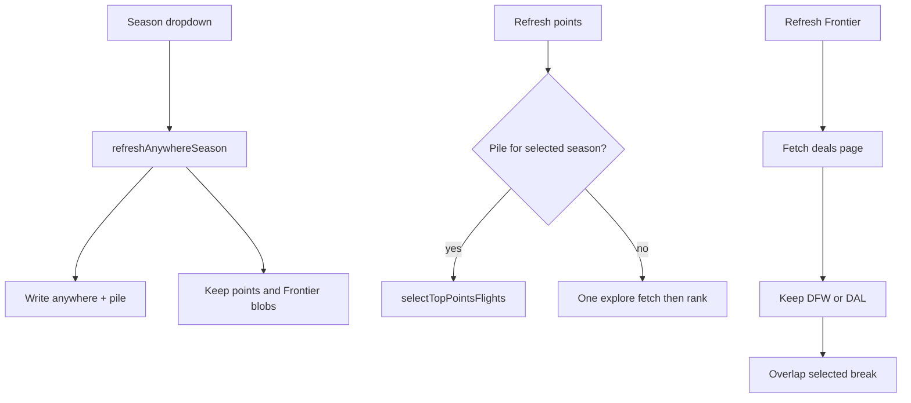

# feat: Points value and Frontier Dallas rows

## Summary

Add `Best points value` and `Frontier from Dallas` rows under cheapest-anywhere on `/personal`. Drop the cash 6-hour cap. Share one season. Refresh the new rows only on their own commands.

---

## Problem Frame

The cash row cannot score Chase/Amex value, and Frontier’s Dallas sale board is a separate glance. The 6-hour filter also hides cheap long-haul and international options. See origin.

---

## Requirements

Carried from origin R1–R18, F1–F3, AE1–AE7.

- R1–R2. Cash heading is `Cheapest flights anywhere`. No duration cap. International allowed.
- R3. Existing `Refresh flights` and season dropdown still refresh cash + PH/China only.
- R4–R10. Points row: same card chrome plus Chase-or-Amex label, points, USD. Re-rank the explore pile. Honest portal math. 10–15% partner rank boost only. Prefer cities not on the cash row. Reuse the cash pile when warm. Own refresh + timestamp.
- R11–R15. Frontier row from the Dallas deals board (DFW and/or DAL). Label one-way vs round-trip. Keep deals whose travel dates overlap the selected break. Own refresh + timestamp.
- R16–R18. Shared season. Season change fetches cash and retitles the other rows. Stale banner: `Showing {previous} — refresh for {selected}`.

---

## Key Technical Decisions

- **Extend the one `FlightStoreState` blob** rather than new KV keys. Add pile + per-row season/timestamp/payload. Cash writers preserve points/Frontier. Points/Frontier writers preserve cash. Matches the season-toggle plan.
- **Persist a wide explore pile on cash fetch.** Today KV keeps top-4 + California only. Points needs the uncapped destination list (cap 40). Cash display stays top-4 + California slot.
- **Partner preference is a static IATA list** in `config.ts`. Explore can include `airline` but we do not use it (origin).
- **Displayed points = cash × 100 ÷ cpp.** Chase 1.5, Amex 1.0. Chase always wins that comparison. Label Chase. Do not fake Amex-only labels.
- **Partner rank score = points × 0.875** (12.5% boost). Displayed points unchanged.
- **Five is a max.** Show fewer when the pile, additive filter, or Frontier overlap yields fewer.
- **California cash-row airports count as cash cities** for the additive filter.
- **Frontier reads the public deals page** (`https://flights.flyfrontier.com/en/flight-deals`), parse HTML, keep DFW/DAL origins. No Apify. No SerpApi `google_flights_deals` in this plan.
- **Frontier parse/fetch failure keeps prior cards** and shows an error, same as cash. Zero overlap is an empty ok row, not an error (AE6).
- **Cash refresh updates the pile silently.** Points cards do not get a banner for same-season pile drift. Next points refresh re-ranks the latest pile.
- **Reuse the existing refresh lock.** Busy refresh is a no-op, same as today.
- **Duration/stops on Frontier may be missing.** Cards omit those lines rather than inventing values.

---

## High-Level Technical Design

---

## Implementation Units

### U1. Drop the duration cap and persist the explore pile

- **Goal:** Cash can show long-haul/international. Refresh stores a wide pile for points reuse.
- **Requirements:** R1, R2, R9
- **Dependencies:** none
- **Files:** `src/lib/dashboard/types.ts`, `src/lib/dashboard/flight-store.ts`, `src/lib/dashboard/flights-anywhere.ts`, `src/lib/dashboard/flights-anywhere.test.ts`, `src/lib/dashboard/flight-refresh.ts`, `src/lib/dashboard/flight-refresh.test.ts`
- **Approach:** Remove the 360-minute filter from `selectTopAnywhereFlights`. Add `selectAnywherePile` (no duration cap, limit 40). Change `getAnywhereDashboard` to return `{ sections, pile }`. Extend store fields with defaults so old KV blobs still read. Cash refresh writes pile + `anywherePileSeasonLabel`. Preserve points/Frontier.
- **Patterns to follow:** `selectTopAnywhereFlights`, `refreshAnywhereSeason` merge-write
- **Test scenarios:**
  - Covers AE1. A 512-minute fare is eligible for cash top-4
  - Missing price still dropped
  - Pile includes destinations beyond the displayed top-4
  - Season refresh writes pile and leaves prior points/Frontier intact
- **Verification:** anywhere tests pass; cash heading change is U4

### U2. Points ranking and refresh

- **Goal:** Rank the pile into five (or fewer) honest Chase-labeled cards. Refresh without a SerpApi call when the pile is warm.
- **Requirements:** R4–R10, F2, AE2–AE4
- **Dependencies:** U1
- **Files:** `src/lib/dashboard/config.ts`, `src/lib/dashboard/config.test.ts`, `src/lib/dashboard/flights-points.ts` (new), `src/lib/dashboard/flights-points.test.ts` (new), `src/lib/dashboard/flight-refresh.ts`, `src/lib/dashboard/flight-refresh.test.ts`, `src/app/personal/actions.ts`, `src/app/personal/actions.test.ts`
- **Approach:** Export `partnerHubAirports`. `selectTopPointsFlights(pile, cashAirportCodes)` applies portal math, 12.5% partner rank boost, then non-cash cities first. `refreshPointsSeason` reuses pile when `anywherePileSeasonLabel` matches the selected season; otherwise one explore fetch that writes pile + points and does not rewrite cash sections. Own `pointsFetchedAt`.
- **Execution note:** Implement ranking test-first.
- **Patterns to follow:** `refreshAnywhereSeason` lock/read/write; `actions.ts` thin wrappers
- **Test scenarios:**
  - Covers AE2. $400 partner vs $350 non-partner: displayed Chase points stay 26,667; partner may rank higher
  - Covers AE3. Cash cities AUS/ATL/ORD/IAH/SFO are deferred until the row cannot fill 5
  - Covers AE4. Warm pile: `getAnywhereDashboard` is not called
  - Cold pile: one explore fetch; cash `anywhere` sections unchanged
  - Action `refreshPoints` revalidates `/personal`
- **Verification:** new points tests plus refresh isolation tests pass

### U3. Frontier parse, overlap, and refresh

- **Goal:** Read the Dallas deals board and keep deals that overlap the selected break.
- **Requirements:** R11–R15, F3, AE6, AE7
- **Dependencies:** U1
- **Files:** `src/lib/dashboard/flights-frontier.ts` (new), `src/lib/dashboard/flights-frontier.test.ts` (new), `src/lib/dashboard/flight-refresh.ts`, `src/lib/dashboard/flight-refresh.test.ts`, `src/app/personal/actions.ts`, `src/app/personal/actions.test.ts`
- **Approach:** Fetch the public deals URL. Parse origin/destination IATA, depart date, price, and one-way vs round-trip from HTML (fixture-tested). Keep DFW/DAL. Overlap: any travel date inside the break inclusive. Fetch fail: error + keep prior cards. Zero overlap: `{ status: "ok", value: [] }`.
- **Execution note:** Parser tests use HTML fixtures, not live network.
- **Patterns to follow:** `SourceResult` fail-closed; refresh lock
- **Test scenarios:**
  - Covers AE7. One-way DFW–LAS is labeled one-way; price is not doubled
  - Covers AE6. September DFW deal is dropped for Spring Break 2027
  - DAL origin is kept; IAH origin is dropped
  - Parse/fetch failure does not wipe prior Frontier cards
  - Action `refreshFrontier` revalidates `/personal`
- **Verification:** frontier unit tests plus refresh isolation tests pass

### U4. Personal page rows and stale banners

- **Goal:** Render both rows under cash. Shared season headings. Per-row refresh. Stale banners. Cash heading loses `≤6h`.
- **Requirements:** R1, R4, R10, R11, R15–R18, F1, AE5
- **Dependencies:** U2, U3
- **Files:** `src/app/personal/page.tsx`, `src/app/personal/page.test.ts`
- **Approach:** Reuse `RefreshButton`. Place points then Frontier under the cash card. Banner when that row’s season label ≠ `anywhereSeasonLabel`. Empty/error copy mirrors cash. No booking links.
- **Patterns to follow:** cash card chrome; news/stock per-section refresh
- **Test scenarios:**
  - Page source contains `Cheapest flights anywhere` and not `≤6h`
  - Points heading `Best points value` and Frontier heading `Frontier from Dallas` appear after the anywhere heading
  - Covers AE5. Banner copy uses the `Showing … — refresh for …` shape
- **Verification:** page string tests pass; `npm test` and `npm run typecheck` pass

---

## Scope Boundaries

**Deferred to Follow-Up Work**

- Live award quotes
- Partner-only or dated Frontier airline search (including SerpApi `google_flights_deals` + `F9`)
- Season dropdown fetching the new rows
- Changing PH/China summer cards or the California slot
- Per-row lock or “refresh in progress” beyond the existing lock no-op

**Out of scope**

- Booking or checkout links
- Auto-refresh
- User-edited partner list

---

## Risks & Dependencies

- Frontier markup can change. Parser is fixture-tested; live empty/error is acceptable.
- SerpApi quota: points refresh must not explore when the pile is warm.
- Old KV blobs lack new fields. Readers must default them.

---

## Sources

- Origin: `docs/brainstorms/2026-08-26-flights-points-frontier-requirements.md`
- Cash explore + 360 filter: `src/lib/dashboard/flights-anywhere.ts`
- Season-only cash refresh: `src/lib/dashboard/flight-refresh.ts`, `docs/plans/2026-07-29-001-feat-domestic-season-toggle-plan.md`
- Frontier board: https://flights.flyfrontier.com/en/flight-deals
